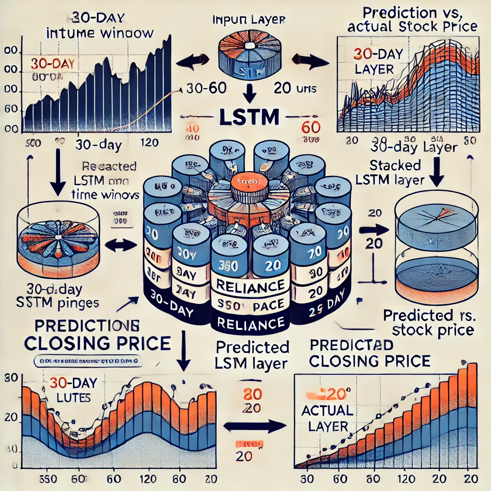

# Predicting Reliance Stock Closing Prices Using LSTM: A Visualization

This project focuses on predicting the next day’s closing price of Reliance stock using a Long-Short Term Memory (LSTM) model. The model is trained on historical stock data with two different time windows (past 30 days and past 120 days) to explore the impact of input window size on predictive performance.

---

## 🎯 Objective

- Develop an LSTM-based model for time-series forecasting of stock prices.
- Compare model performance using past 30-day and 120-day time windows.
- Evaluate the effectiveness of the LSTM architecture for financial forecasting.

---

## 📂 Dataset

### **Reliance Stock Dataset**
- **Description**: Historical stock data of Reliance Industries, including attributes like Open, High, Low, Close, and Volume.
- **Focus**: The model uses the **Close** price for prediction.
- **Data Preparation**:
  - Data is normalized to the range (0, 1) for better model convergence.
  - Data is split into 80% training and 20% testing sets.

---

## 🛠️ Model Architecture

- Three stacked LSTM layers:
  - **Layer 1**: 100 units, `return_sequences=True`.
  - **Layer 2**: 60 units, `return_sequences=True`.
  - **Layer 3**: 20 units.
- Output layer:
  - Dense layer with ReLU activation for prediction.

---

## 🚀 Training Details

- **Optimizer**: Adam with a learning rate of 0.0005.
- **Loss Function**: Mean Squared Error (MSE).
- **Batch Size**: 32
- **Epochs**: 50
- **Validation Split**: 20% of the training data.

---

## 🌟 Key Learnings

1. **Impact of Time Window**:
   - Larger time windows (e.g., 120 days) generally provide better context for prediction but can lead to overfitting with small datasets.
   - Smaller time windows (e.g., 30 days) focus more on recent trends, which may improve short-term accuracy.

2. **LSTM Stacking**:
   - Adding multiple LSTM layers improves the model's ability to capture long-term dependencies in stock price trends.

3. **Optimization**:
   - Adam optimizer with a low learning rate and ReduceLROnPlateau helps stabilize training for time-series data.

4. **Evaluation**:
   - MSE is used to measure prediction errors, with lower values indicating better performance.

---

## 📊 Results

- **Test Loss (MSE)**:
  - Time Window = 30 days: 
  - Time Window = 120 days: 

---

## 📜 License

This project is licensed under the **MIT License**. You are free to use the code and data for educational and non-commercial purposes.

---

## 🌐 Connect with Me

If you'd like to connect, collaborate, or provide feedback, feel free to reach out:

- **LinkedIn**: [Vijay Mahawar](https://www.linkedin.com/in/vijay-mahawar)
- **GitHub**: [vmahawar](https://github.com/vmahawar)
