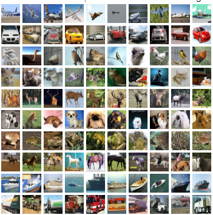

# CAPSTONE PROJECT: CIFAR-10 Object Recognition Using CNN



This project is a part of the **Continuing Education Program in Machine Learning and Deep Learning** at **IIT Delhi**, Batch-3 (July 2024 - Jan 2025). It focuses on developing a Convolutional Neural Network (CNN) to classify images from the CIFAR-10 dataset into ten predefined classes. Additionally, a Streamlit-based web application has been integrated to allow testing with external images via URLs.

## **Project Overview**
- **Objective**: Build a robust CNN model for image classification on the CIFAR-10 dataset.
- **Dataset**: [CIFAR-10 Dataset](https://www.cs.toronto.edu/~kriz/cifar.html)
- **Classes**: Airplane, Automobile, Bird, Cat, Deer, Dog, Frog, Horse, Ship, Truck.
- **Implementation Highlights**:
  - Developed using TensorFlow and Keras.
  - Integrated Streamlit app for real-time classification.
  - Visualized model performance through training/validation accuracy plots.

## **Key Features**
1. **Dataset Preprocessing**:
   - Normalized pixel values to [0, 1] range.
   - One-hot encoded class labels.
2. **CNN Architecture**:
   - Three convolutional layers with ReLU activation and max-pooling.
   - Dropout layer for regularization.
   - Fully connected softmax layer for classification.
3. **Model Training**:
   - Optimizer: Adam
   - Loss Function: Categorical Crossentropy
   - Batch Size: 64
   - Epochs: 10

## **Results**
- Achieved a test accuracy of approximately **70-75%**.
- Training and validation accuracy plots highlight consistent model learning.

## **How to Run**
1. Clone the repository:
   ```bash
   git clone <repository_url>
   ```
2. Install dependencies:
   ```bash
   pip install -r requirements.txt
   ```
3. Train the model or load the pre-trained model from `cifar10_cnn_model.h5`.

## **Resources**
- **Dataset**: [CIFAR-10 Dataset](https://www.cs.toronto.edu/~kriz/cifar.html)

## **Website**
Visit the project website for detailed insights: [IITD CEP Capstone Team-2](https://sites.google.com/view/iitd-cep-capstone-team-2)

## **Acknowledgments**
This project was submitted by **Team-2** under the guidance of the instructors of IIT Delhi's **Continuing Education Program in Machine Learning and Deep Learning**.

---
